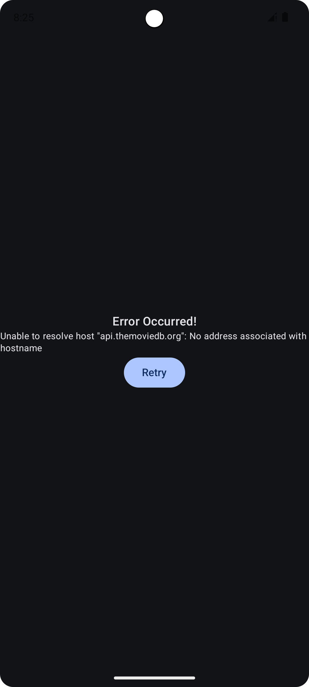

# Android Movie App

This is a simple Android app that displays a list of movies from the [The Movie Database API](https://www.themoviedb.org/documentation/api), their details and trailer.

The app uses following technologies:
- Jetpack Compose for the UI
- ViewModels and Flow APIs for state management
- Compose Navigation for navigation
- Hilt for dependency injection
- Retrofit for network requests
- Coil for image loading
- android-youtube-player for playing youtube videos

## How to run
- Add the API_KEY and BEARER_TOKEN in the `local.properties` file.

## Architecture

The app uses the MVVM architecture pattern. The app is divided into three layers:
- **Data layer**: This contains all the models and data sources such as TmdbApi.
- **Domain layer**: This contains the sole repository named `MovieRepository` which is responsible
for fetching the data from the data source and providing it to the presentation layer.
- **Presentation layer** (ui): This contains the UI components and ViewModels. 
The ViewModels are responsible for fetching the data from the repository and providing it to the UI components.

The app uses single activity architecture (MainActivity). All the routing logic is contained in the `AppNavigation` file.
It uses the `NavHost` composable to navigate between different screens.

## State handling logic

### HomeScreen
Uses simple states handling logic where there's single loading and error states for whole screen.
Whenever any error occurs in any of the API; the whole screen is shown with an error message.

### MovieDetailsScreen
This screen uses separate error and loading states for each of the resource.
This is done by wrapping them in `Res` sealed interface which has `Loading`, `Success` and `Error` states.

This allows us to contain the error to the enclosing element; so that the rest of the element can still keep working (similar to Error Boundaries in other frameworks such as Next.js).

## Some shortcuts taken. Known issues.
- Currently UI is forced in dark mode. This is to match the sample design.
- App does not handle trailer sources other than Youtube.
- Some icons can be improved.
- App does not separate different models for different layers. It reuses data layer models for everything.
- There are some layout and padding issues in the UI.
- Error and loading states should be enclosed in Scaffold to allow navigation ??.
- All modularized by keeping related files in separate folder under single module `app`. It is not actually modularized.